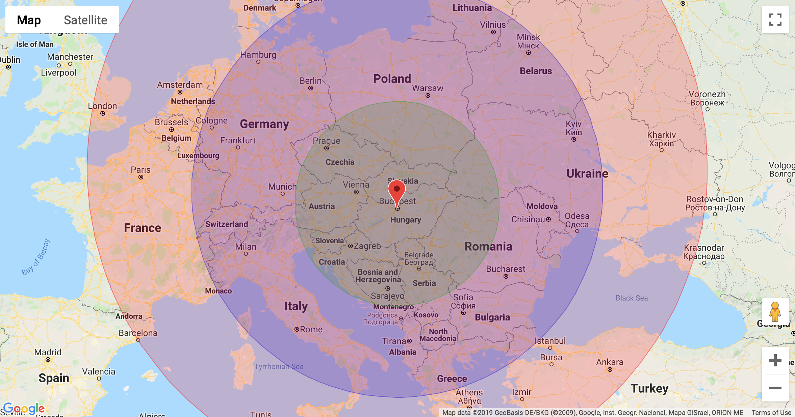

### Visualising driving distances from a base location as layers on a Google Map

First of all you need to get your own [Google Maps API key](https://developers.google.com/maps/documentation/javascript/get-api-key). Go get one and replace `<put-your-Google-Maps-API-key-here>` with it.

You need to get a web server to "host" the pages, so one is included as a Docker container.

Make sure that Docker Engine is running.

Then from the root of the project start the containerised Apache:

```shell
docker-compose up
```

Apache will pick up a basic `httpd.conf` from apache/conf.

Simply visit http://localhost and click on the HTML file.

The `oneDayDistanceInMeters` parameter sets the base distance in meters, feel free to adjust it to your preferred setting.

```javascript
oneDayDistanceInMeters = 500000; // 500 km
```

#### Sample map view



Tested on

* Docker Engine 18.09.2
* Apache/2.4.39
